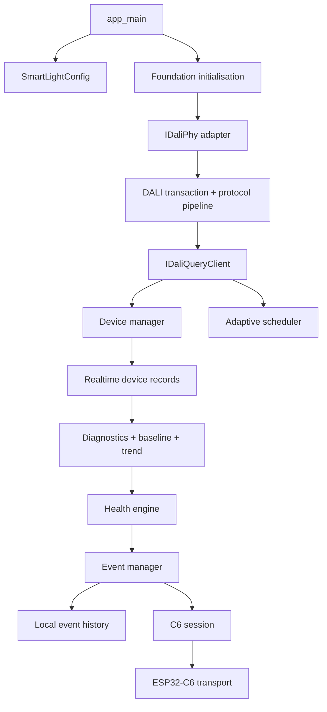

# Firmware architecture and integration guide

This guide explains how the Savantix DALI edge-controller firmware works today and how to replace the demo/simulator path with the production hardware stack.

## What runs where

The firmware is deliberately split into portable C++ components and a thin ESP-IDF composition layer. The portable components own protocol and domain behavior; `main/` owns board configuration, ESP-IDF startup, FreeRTOS task creation, and concrete adapters.



### Boot path

1. `main/app_main.cpp` loads `SmartLightConfig::fromKconfig()`.
2. `SmartLightConfig::validate()` rejects invalid limits and unsupported GPIO combinations.
3. `initialiseFoundation()` calls `IDaliPhy::init()` and checks bus power, transceiver health, and stuck-line flags.
4. The protocol self-check sends a short `QUERY STATUS` through `DaliTransactionService`, `DaliProtocolPipeline`, and the response parser.
5. The current demo starts `DemoController::step()` once per second. That task is the integration seam for the production polling/event task.

The boot boundary is intentionally fail-closed: when demo mode is disabled and no hardware PHY has been selected, startup logs a warning and returns without touching GPIOs or the DALI bus.

### Runtime data flow

The normal production loop should follow this order:

1. `DaliScheduler::next()` chooses the next poll using the device context, current bus utilisation, and normal/diagnostic limits.
2. The selected request is converted to a typed DALI command and passed to `DaliProtocolPipeline`.
3. `DaliTransactionService` performs bounded retries and preserves the concrete `PhyResult` failure cause.
4. `PipelineQueryClient` converts responses into validity-bearing `Reading<T>` values; unsupported or missing data remains unavailable instead of becoming zero.
5. `DaliDeviceManager` updates presence, capabilities, and `DaliDeviceRecord` state. Missing presence is hysteretic (three failed scans), and recovery emits a change.
6. Diagnostics, baseline bands, trend windows, and `LightHealthEngine` evaluate the observation. Health uses score thresholds plus persistence and recovery hysteresis.
7. `EventManager` deduplicates by address/event family, emits activation/escalation/clear/reminder transitions, and forwards only meaningful transitions to storage and C6.

## Production integration checklist

### 1. Select and validate the electrical PHY

Do not connect ESP32-S3 GPIO directly to the DALI pair. Select an isolated, compliant DALI transceiver and document its logic polarity, timing, bus-power indication, collision behavior, and fault outputs.

Implement `dali::IDaliPhy` in a new component, for example:

```text
components/dali_phy_hw/
├── CMakeLists.txt
├── include/dali/phy_hw/esp_dali_phy.h
└── esp_dali_phy.cpp
```

The adapter must implement all methods in [`i_dali_phy.h`](../components/dali_phy/include/dali/phy/i_dali_phy.h):

- `init()` configures GPIO/peripherals and returns a concrete `PhyResult`.
- `transmit()` sends one 16-bit forward frame with the transceiver's required timing.
- `receive()` blocks only up to the supplied timeout and reports timeout/collision/bus faults accurately.
- `isBusBusy()` and `hasCollision()` expose live bus state for transaction admission.
- `health()` reports bus power, transceiver health, and stuck-line detection.
- `reset()` returns the adapter to a known idle state after a bus or transceiver fault.

Keep the simulator implementing the same interface. That lets host tests and the production pipeline use the same protocol code.

### 2. Replace the simulated PHY at the composition boundary

In `main/app_main.cpp`, replace:

```cpp
static dali::SimulatedDaliPhy simulatedPhy;
const FoundationResult result = initialiseFoundation(config, simulatedPhy);
```

with the board adapter:

```cpp
static dali::EspDaliPhy daliPhy{
    config.daliTxGpio,
    config.daliRxGpio,
    config.busPowerGpio,
    config.transceiverFaultGpio};
const FoundationResult result = initialiseFoundation(config, daliPhy);
```

The rest of the transaction and parsing stack should remain unchanged. Add the hardware component to `main/CMakeLists.txt` under `REQUIRES` and keep `dali_simulator` available for host tests.

### 3. Add the real C6 transport

`components/c6_interface` currently provides CRC16 framing, sequence numbers, acknowledgement state, bounded payloads, and `MockC6Transport`. Create an ESP-IDF transport that owns the configured UART (or the selected board-to-board link) and implements the transport interface used by `C6Session`.

The wire contract is encoded by `FrameCodec`: start marker, version, message type, 16-bit sequence, 16-bit payload length, payload, CRC16, and end marker. Keep framing independent from UART driver calls so `test_c6_interface.cpp` continues to exercise the exact codec.

Only forward:

- event activation, escalation, clear, or reminder;
- device state changes such as discovered/missing/recovered;
- requested status/summary responses;
- explicit diagnostic requests or replies.

Do not forward every repeated measurement. This is the reason C6 publishing lives behind `EventManager` and a bounded session rather than inside the raw DALI query loop.

### 4. Replace the demo loop with task ownership

The current demo task is intentionally simple:

```cpp
while (true) {
    controller->step(nowMs());
    vTaskDelay(pdMS_TO_TICKS(1000));
}
```

For production, split responsibilities into bounded tasks or one orchestrating task with explicit queue ownership:

| Task | Owns | Publishes |
| --- | --- | --- |
| DALI worker | `DaliProtocolPipeline`, PHY access, transaction timing | query results |
| Poll scheduler | `DaliScheduler`, due times, utilisation admission | poll requests |
| Observation worker | device records, diagnostics, baselines, trends, health | observations and health transitions |
| Event/C6 worker | `EventManager`, `LocalEventHistory`, `C6Session` | event frames and acknowledgements |
| Monitor | `SystemMonitorTask` | heartbeat/queue health |

If a single task is preferred for the first board bring-up, preserve the same ordering and do not allow unrelated tasks to call the PHY concurrently. `IDaliPhy` is not a multi-owner interface.

### 5. Wire persistence and time

Use `LocalEventHistory` for bounded event records and `NvsMetadataStore` for metadata that must survive reboot. Keep CRC validation and capacity limits enabled. Use the `time_service` monotonic source for scheduler deadlines, persistence windows, and trend intervals; add wall-clock synchronisation only for timestamps exported to the C6 peer or site logs.

### 6. Enable configuration only after board validation

Run `idf.py menuconfig` → **Savantix DALI Edge Controller** and set:

- DALI TX/RX pins for the validated transceiver;
- bus-power and transceiver-fault inputs and their polarity;
- optional ADC channels only after calibration;
- C6 UART pins and transport enablement;
- light count and polling/retry/utilisation limits;
- demo mode off for production.

Do not set placeholder GPIOs to arbitrary pins. A wrong polarity or bus-power assumption can make the controller appear healthy while driving an unsafe or non-compliant bus.

## Verification sequence before field use

Run the portable suite first:

```bash
cmake -S test/host -B build-host -DCMAKE_BUILD_TYPE=Debug
cmake --build build-host --parallel
ctest --test-dir build-host --output-on-failure
```

Then build the target:

```bash
. "$HOME/esp/esp-idf-v6.0.2/export.sh"
idf.py set-target esp32s3
idf.py build
```

Before connecting DALI power, complete these hardware checks:

1. PHY loopback/timing and stuck-line tests with the bus isolated.
2. Bus-power loss, transceiver-fault, collision, and timeout injection.
3. Discovery/missing/recovery hysteresis with known gear.
4. DALI conformance and electrical/EMC review for the selected transceiver and board.
5. C6 framing, sequence, acknowledgement, retry, and power-cycle tests.
6. FAT/SAT evidence for thermal, current, power, lamp-failure, and communication degradation cases.

The current repository proves the portable behavior and ESP-IDF composition with the simulator. It does not claim that a specific DALI transceiver, board layout, EMC profile, UART peer, or field installation has been validated.
